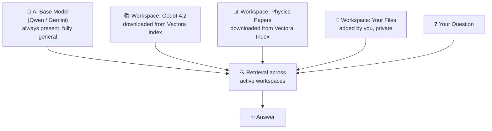

# Vectora

> [!TIP]
> Read this file in another language | Leia esse arquivo em outro idioma.  
> [English](README.md) | [Portugues](README.pt.md)

**A private NotebookLM that runs entirely on your machine.**

Vectora is a local AI assistant that learns from whatever you give it — documents, code, papers, images — and answers questions based strictly on that content. Think Google NotebookLM, but running on your hardware, with your data never leaving your machine.

No cloud dependency. No recurring cost. No data leaving your machine.

---

## The Problem

You know when you ask an AI about something very specific — a particular version of a framework, an internal document, a niche research paper — and it either makes something up or gives you a generic answer that misses the point entirely?

That happens because the AI has no access to _your_ context. Vectora fixes that. Feed it your files, point it at a knowledge base, and it answers from exactly that — nothing more, nothing less.

---

## How It Works

Vectora embeds your files and downloaded knowledge bases into isolated local vector databases. When you ask a question, it retrieves the most semantically relevant context from whichever workspaces you have active and sends everything — along with your question — to the language model.



Each workspace is a completely isolated namespace. Contexts never bleed into each other. You control which workspaces are active per session.

---

## Vectora Index

The Index is a curated marketplace of knowledge bases — pre-built vector datasets published by the community and reviewed by Kaffyn before becoming available for download.

From inside the Vectora app, you can browse the full catalog with search and filters, read a lightweight README for each dataset describing its contents, download any dataset directly into your local Vectora as a new workspace, and publish your own knowledge bases for others to use.

**Examples of what you'll find in the Index:**

- Godot 4.x documentation (per version)
- Frontend and backend framework references
- Engineering, physics, and computer science papers
- Game design resources, language specs, and more

Every dataset downloaded from the Index is embedded and stored locally. After download, no network request is made at query time.

---

## What Can You Do With It?

**Study & Research**
Drop PDFs, papers, or notes into a workspace. Ask Vectora to explain, summarize, cross-reference, or quiz you. Everything stays local and private.

**Development**
Combine an engine documentation workspace with your own codebase workspace. Get answers that are aware of both the API contract and your actual implementation.

**Deep Work**
Use Gemini mode to index images, PDFs, and audio alongside text — all processed and stored locally after indexing.

**IDE Integration**
Expose any workspace as an MCP server, feeding precise context directly into tools like Cursor, VS Code, or Claude Code.

---

## Installation

### System Requirements

- **Windows 10+**, **macOS 11+**, or **Linux** (Ubuntu/Debian)
- **4GB RAM minimum** (8GB recommended)
- **500MB disk space** minimum (more for larger models)

### Download and Install

1. **Download the installer** from the [latest release](https://github.com/Kaffyn/Vectora/releases)
   - Windows: `vectora-setup.exe`
   - macOS: `vectora-setup.dmg` (coming soon)
   - Linux: Installation instructions (coming soon)

2. **Run the installer:**
   - Windows: Double-click `vectora-setup.exe` and follow the wizard
   - The installer will automatically detect your hardware and recommend an optimal AI model

3. **First Run:**
   - Vectora will appear in your system tray
   - Click to open Vectora Desktop Application
   - Or open from Start Menu → Vectora

### Configuration

**Option 1: Qwen (Local / Offline)** — Recommended for privacy

- No setup required for basic functionality
- Vectora automatically downloads Qwen3-7B on first run
- Choose a different model from settings if desired
- Models are stored locally in `%USERPROFILE%\.Vectora\models\`

**Option 2: Gemini (Cloud / Multimodal)**

- Go to Settings → LLM Providers
- Click "Configure Gemini"
- Paste your Gemini API key
- Key is encrypted and stored only on your machine

### Building from Source

If you want to build Vectora yourself:

1. **Clone the repository:**

   ```bash
   git clone https://github.com/Kaffyn/Vectora.git
   cd Vectora
   ```

2. **Install dependencies:**
   - See [CONTRIBUTING.md](CONTRIBUTING.md) for detailed setup instructions
   - Requires Go 1.22+, Node.js 20+, and Bun

3. **Build all components:**

   ```bash
   # Windows (PowerShell)
   .\build.ps1

   # macOS/Linux (Make)
   make build-all
   ```

4. **Run the application:**
   ```bash
   ./build/vectora
   ```

### Troubleshooting Installation

**"Windows protected your PC"** when running installer

- Click "More info" → "Run anyway"
- This is normal for unsigned installers; your files are safe

**Installer closes immediately**

- Try running as Administrator: Right-click → "Run as administrator"
- Check your antivirus isn't blocking the installer

**Can't find Vectora after installation**

- Check your system tray (bottom-right corner on Windows, top-right on macOS)
- Or search for "Vectora" in Start Menu

**Models won't download or chat doesn't work**

- Ensure you have internet connection (required for initial setup)
- Check Settings → Advanced for logs
- See [CONTRIBUTING.md](CONTRIBUTING.md) for detailed troubleshooting

### Getting Help

- **Documentation:** See [CONTRIBUTING.md](CONTRIBUTING.md) for developer guides
- **Issues:** [Report bugs on GitHub](https://github.com/Kaffyn/Vectora/issues)
- **Questions:** Start a [Discussion](https://github.com/Kaffyn/Vectora/discussions)

---

## AI Providers

Vectora supports two providers out of the box, with the engine built to accommodate more in the future:

**Qwen (Local / Offline)**
Runs entirely on your hardware via `llama-cli` using its Zero-Port pipe architecture. No internet required. Supports the Qwen3 lineage — from lightweight general-purpose models (0.6B, 1.7B, 4B, 8B) to specialized reasoning and coding variants (see section below for details). Ideal for fully private workflows.

**Gemini (Cloud / Multimodal)**
Uses your own Gemini API key, stored only in your local config. Unlocks multimodal indexing — PDFs, images, and audio are all supported. The key never leaves your machine.

Both providers include dedicated embedding models. Vectora does not rely on a separate embedding service.

## Qwen Official Models

Vectora supports the new **Qwen3** and **Qwen3.5** lineage, optimized for different development fronts:

**General Purpose & Instruct**

- **Qwen3 (0.6B/1.7B/4B/8B):** Lightweight instruction-following models for general tasks, summarization, and content generation. Small footprint, ideal for resource-constrained environments.

**Coding & Reasoning**

- **Qwen3-Coder-Next (80B):** The state-of-the-art for massive refactoring and system architecture.
- **Qwen3-4B-Thinking (2507):** Logical reasoning model (Chain-of-Thought) for complex bug resolution.

**Vision & Multimodal (Thinking VL)**

- **Qwen3-VL-Thinking (2B/8B):** Vision models that "think" about the image, ideal for analyzing UI bug screenshots or architecture diagrams.
- **Qwen3-VL-Embedding (2B):** Vectorization of visual assets and diagrams for semantic search in GDDs.

**Audio & Speech (ASR/TTS)**

- **Qwen3-ASR (0.6B):** Ultra-fast transcription of sprint meetings and feedback audio.
- **Qwen3-TTS-VoiceDesign (1.7B):** High-fidelity voice synthesis (12Hz) for real-time dialogue prototyping.

**RAG & Embeddings**

- **Qwen3-Embedding (0.6B/4B/8B):** The vector search engines that power chromem-go. **We recommend the 0.6B version** for the strict 2GB RAM limit, ensuring your code context is precisely retrieved without compromising system performance.

---

## Interfaces

Vectora is not a single app — it is an ecosystem of interfaces sharing a common core via IPC, all orchestrated by a lightweight systray daemon:

| Interface              | Description                                                                                                    |
| ---------------------- | -------------------------------------------------------------------------------------------------------------- |
| **Systray**            | The core daemon. Lives near your clock, orchestrates everything, ~100MB RAM.                                   |
| **Desktop App (Fyne)** | Native cross-platform desktop application. Chat interface, workspace management, settings, and Index browsing. |
| **CLI (Bubbletea)**    | Terminal interface. Minimal footprint, instant response.                                                       |
| **MCP Server**         | Exposes Vectora's knowledge to external AI tools and IDEs.                                                     |
| **ACP Agent**          | Autonomous agent mode with filesystem and terminal access.                                                     |

---

## Agentic Toolkit

When operating in MCP or ACP mode, Vectora exposes a shared set of tools built from scratch in Go:

- **Filesystem:** `read_file`, `write_file`, `read_folder`, `edit`
- **Search:** `find_files`, `grep_search`, `google_search`, `web_fetch`
- **System:** `run_shell_command`
- **Memory:** `save_memory`, `enter_plan_mode`

> [!IMPORTANT]
> Every write or shell action triggers an automatic snapshot via `internal/git` before execution. Any agentic action can be fully rolled back with a single `undo` command.

---

## Architecture

Vectora is written entirely in Go. The core runs as a lightweight systray daemon orchestrated by **Cobra**, the industry-standard CLI framework for Go.

| Component       | Technology          | Role                                                                    |
| --------------- | ------------------- | ----------------------------------------------------------------------- |
| Vector DB       | chromem-go          | Semantic search and embeddings                                          |
| Key-Value DB    | bbolt               | Chat history, logs, config                                              |
| AI Engine       | langchaingo         | LLM and embedding provider abstraction (Gemini, extensible)             |
| Local Inference | llama-cli (pipes)   | Offline model execution (Qwen3)                                         |
| **Daemon Core** | **Cobra + Systray** | **Master daemon: exposes CLI, Systray, IPC (local), HTTP API (remote)** |
| Installer       | **Cobra + Fyne**    | **Dual-mode: headless CLI install or graphical setup wizard**           |
| Desktop App     | **Fyne**            | **Native GUI application (spawned subprocess, via IPC)**                |
| Terminal UI     | **Bubbletea**       | **Terminal User Interface (spawned subprocess, via IPC)**               |
| Index Server    | Go (net/http)       | Vector dataset catalog and distribution                                 |

### Why Cobra?

**Cobra** serves as the unified CLI foundation for both the Installer and Daemon:

- **Single Source of Truth**: The same business logic that runs `vectora install --headless` via terminal also powers the graphical installer. No divergence between CLI and GUI modes.
- **No Sidecars**: The Daemon itself _is_ the CLI. Commands like `vectora status`, `vectora update`, `vectora logs` run directly without external scripts or wrappers.
- **Automatic UX**: When you run `vectora` without flags, Cobra detects the environment and silently spawns the Fyne UI. In headless environments, it operates pure CLI.
- **Headless First**: Essential for CI/CD, SSH deployments, and automation. A single binary works in interactive desktops, headless servers, and automation pipelines.

### Interface Architecture

```
vectora [Cobra CLI] ← Single daemon binary
├─ --headless → Pure CLI mode (no UI)
├─ default → Systray + Fyne UI (auto-detect)
├─ tui → Spawn Bubbletea TUI (subprocess)
└─ http :8080 → HTTP API for MCP/ACP (always available)
```

**IPC** (pipes/named pipes) handles **local inter-process communication** between daemon and UI subprocesses.
**HTTP** (required for MCP/ACP) handles **remote integrations** with external tools and IDEs — we're flexible here, not strict about IPC-only.

Designed to operate under **4GB of RAM** on modest hardware.

---

## Roadmap

- [ ] Full end-to-end integration (in progress)
- [ ] Public first release
- [ ] Vectora Index public launch
- [ ] Multimodal indexing (images, PDFs) via Gemini
- [ ] Audio transcription and indexing
- [ ] Vectora site and documentation

---

_Part of the [Kaffyn](https://github.com/Kaffyn) open source organization._
