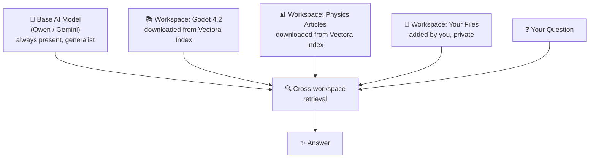

# Vectora

> [!TIP]
> Read this file in another language | Leia esse arquivo em outro idioma.  
> [English](README.md) | [Português](README.pt.md)

**A private NotebookLM that runs entirely on your machine.**

Vectora is a local AI assistant that learns from whatever you provide — documents, code, articles, images — and answers questions strictly based on that content. Think of Google NotebookLM, but running on your hardware, with your data never leaving your machine.

No cloud dependency. No recurring cost. No data leaves your machine.

---

## The Problem

You know when you ask an AI about something very specific — a particular version of a framework, an internal document, a niche technical article — and it makes something up or gives a generic answer that completely misses the point?

This happens because the AI doesn't have access to *your* context. Vectora solves this. Provide your files, point to a knowledge base, and it will answer exactly based on that — nothing more, nothing less.

---

## 🛡️ Security and Privacy by Design

### Hard-Coded Guardian (Always Active - Deterministic)

- **System Filter:** Regardless of the chosen mode (Local or Cloud), Vectora has an immutable internal protection layer. Indexing and reading tools **automatically ignore** sensitive files such as `.env`, `.key`, `.pem`, databases (`.db`, `.sqlite`), and executable binaries (`.exe`, `.dll`, `.so`).
- **Blocking at the source:** These files are never read, never embedded in the vector database, and never reach the inference engine (whether local or via API).
- **Guarantee:** Security does not depend on the model's intelligence, but on operational system rules. Your secrets are protected even if you are using the cloud.

### Local Mode (Total Privacy)

- **Guardian Model:** `Qwen3-Embedding` (0.6B) acts as the only authorized process to modify the local vector database and filter content.
- **Data Filtering (DLP):** Before sending any prompt to the cloud, Vectora analyzes the retrieved context. If it detects critical secret patterns (keys, passwords) that passed through previous layers, it alerts the user and blocks the transmission.

### Cloud-Only Mode (Disclaimer)

- **Secure Context:** Even in this mode, the **Hard-Coded Guardian** prevents the indexing of sensitive files. Only legitimate documents (source code, docs, scripts) are sent to the API.
- **Data Transfer:** To use advanced cloud capabilities (Gemini, Claude, etc.), Vectora sends the retrieved context directly to the API provider.
- **Disclaimer:** By activating Cloud-Only Mode, the user acknowledges they are providing the retrieved context for processing on third-party servers. Kaffyn **is not responsible** for any leaks, misuse, or training of data by external AI providers. We strongly recommend avoiding the transmission of sensitive information, production keys, or critical proprietary code in this mode.

---

## 📚 Vectora Index: The Heart of Knowledge

**Vectora Index** is the strategic asset that separates Vectora from other generic AIs. It is a curated marketplace of knowledge bases (vector datasets).

### How It Works

Vectora embeds your files and downloaded knowledge bases into isolated local vector databases. When you ask a question, it retrieves the most semantically relevant context from any active workspaces and sends everything — along with your question — to the language model.



Each workspace is a completely isolated namespace. Contexts never leak between workspaces. You control which workspaces are active per session.

### Key Features

- **Curated Datasets:** Official documentation (Godot 4.x, Python, Rust), technical articles, engine specifications, and reference source code.
- **Secure Download:** Downloaded datasets are indexed locally. After download, no network requests are made during queries.
- **Safe Re-Embedding:** When publishing a project to the Index, content is processed by Kaffyn's dedicated servers using `Qwen3-Embedding` before indexing. This ensures maximum quality without exposing raw data to public models during processing.
- **Restrictive Sharing (RBAC):**
  - **Private:** Only you.
  - **Team:** Share with specific members via Kaffyn Account. Set read/write permissions.
  - **Public:** Available to everyone in the catalog. When publishing publicly, you acknowledge that others may perform RAG on this dataset, but the indexing process was done securely.

> [!IMPORTANT]
> **Index Privacy Policy:** Kaffyn performs curation and processing **only on datasets marked as Public**. **Private** and **Team** workspaces remain exclusively on your device or your private encrypted cloud. **Neither Kaffyn nor our servers have access to data contained in private or team workspaces.** They are secure, isolated, and inaccessible to us.

**Examples of what you'll find in the Index:**

- Godot 4.x documentation (by version)
- Frontend and backend framework references
- Engineering articles, physics, and computer science resources
- Game design resources, language specifications, and more

Every dataset downloaded from the Index is indexed and stored locally. After download, no network requests are made during query time.

---

## What You Can Do With It

**Study & Research**
Drag PDFs, articles, or notes into a workspace. Ask Vectora to explain, summarize, correlate, or test your knowledge. Everything stays local and private.

**Development**
Combine a motor documentation workspace with your own code workspace. Get answers that know both the API contract and your actual implementation.

**Deep Work**
Use Gemini mode to index images, PDFs, and audio alongside text — all processed and stored locally after indexing.

**IDE Integration**
Expose any workspace as an MCP server, providing precise context directly to tools like Cursor, VS Code, or Claude Code.

---

## Installation

**System Requirements:**

- **OS:** Windows 10+, macOS 11+, Linux (Ubuntu/Debian).
- **RAM:** **8GB Minimum** (Total System). **16GB Recommended**.
- **Internet:** Required for initial setup and cloud model usage.

**Download and Install:**

1. **Download Setup** from [latest release](https://github.com/Kaffyn/Vectora/releases)
   - Windows: `vectora-setup.exe`
   - macOS: `vectora-setup.dmg`
   - Linux: `vectora-setup.deb`

2. **Run and Configure Packages**
   - On first launch, the setup will integrate LPM and MPM tools to configure your environment:
   - **LPM (Llama Package Manager):** Downloads and configures the inference engine (`llama.cpp`) optimized for your hardware.
   - **MPM (Model Package Manager):** Manages the catalog and downloads AI models.
   - During installation, use the interface to select and download your desired model via **MPM** (e.g., **Qwen3-7B** for balanced performance or **Qwen3-0.6B** for modest hardware).

3. **First Run**
   - After installation, the **Vectora Daemon** starts automatically in the system tray.
   - Click the icon to open the **Desktop app (Fyne)** or type `vectora tui` in the terminal for the text interface.

**Configuration:**

**Option 1: Qwen (Local / Offline)** — Recommended for privacy

- No configuration needed for basic functionality
- Manage your models via **MPM**
- Models are stored locally in `%USERPROFILE%\.Vectora\models\`

**Option 2: Gemini (Cloud / Multimodal):**

- Go to Settings → LLM Providers
- Click "Configure Gemini"
- Paste your Gemini API key
- The key is encrypted and stored only on your machine

---

## AI Providers

Vectora natively supports two providers, with the engine built to accommodate more in the future:

**Qwen3 (Local / Offline)**
Runs entirely on your hardware via `llama-cli` using streaming pipes. No internet required. Supports the Qwen3 family — from lightweight generalist models (0.6B, 1.7B, 4B, 8B) to specialized reasoning and code variants. Ideal for fully private workflows.

**Gemini (Cloud / Multimodal)**
Uses your own Gemini API key, stored only in your local config. Unlocks multimodal indexing — PDFs, images, and audio are all supported. The key never leaves your machine.

Both providers include dedicated embedding models. Vectora doesn't depend on a separate embedding service.

## Official Qwen3 and Qwen3.5 Models

Vectora supports the new **Qwen3** and **Qwen3.5** families, optimized for different development fronts:

- **Qwen3 (1.7B/4B/8B):** Lightweight instruction-following models for general tasks, summarization, and content generation. Small footprint, ideal for resource-constrained environments.

- **Qwen3-Embedding (0.6B/4B/8B):** The vector search engines powering chromem-go. **We recommend the 0.6B version** for strict 4GB RAM limits, ensuring your code context is retrieved accurately without compromising system performance.

---

## Interfaces

Vectora isn't a single app — it's an ecosystem of interfaces sharing a common core via IPC, all orchestrated by a lightweight daemon in the system tray:

| Interface               | Description                                                                                                    |
| ----------------------- | -------------------------------------------------------------------------------------------------------------- |
| **Daemon Core (Cobra)** | The central brain. Manages lifecycle, installation, updates, and connections.                                  |
| **Desktop App (Fyne)**  | Native cross-platform desktop application. Chat interface, workspace management, config, and Index navigation. |
| **Vectora TUI**         | Interactive terminal interface. Minimal footprint, instant response.                                           |
| **MCP/ACP Server**      | Exposes Vectora knowledge to external AI tools and IDEs via HTTP.                                              |

---

## Toolkit for Agents

When operating in MCP or ACP mode, Vectora exposes a shared set of tools built from scratch in Go:

- **Filesystem:** `read_file`, `write_file`, `read_folder`, `edit`
- **Search:** `find_files`, `grep_search`, `google_search`, `web_fetch`
- **System:** `run_shell_command`
- **Memory:** `save_memory`, `enter_plan_mode`

> [!IMPORTANT]
> Every write action or shell command triggers an automatic snapshot via `GitBridge` in `internal/git` before execution. Any agentic action can be fully reverted with a single `undo` command.

---

## Architecture

Vectora is written entirely in Go. The core runs as a lightweight daemon in the system tray orchestrated by **Cobra**, the industry-standard CLI framework for Go.

| Component       | Technology          | Role                                                                     |
| --------------- | ------------------- | ------------------------------------------------------------------------ |
| Vector DB       | chromem-go          | Semantic search and embeddings                                           |
| Key-Value DB    | bbolt               | Chat history, logs, configuration                                        |
| AI Engine       | **Direct Calls**    | Optimized HTTP/STDIO calls to APIs and `llama.cpp`. No heavy frameworks. |
| Local Inference | llama-cli (pipes)   | Offline model execution (Qwen3)                                          |
| **Daemon Core** | **Cobra + Systray** | **Master daemon: exposes CLI, Systray, IPC (local), HTTP API (remote)**  |
| Installer       | **Cobra + Fyne**    | **Dual mode: headless CLI installation or graphical assistant**          |
| Desktop App     | **Fyne**            | **Native GUI application (spawned subprocess via IPC)**                  |
| TUI Interface   | **Bubbletea**       | **Terminal User Interface (spawned subprocess via IPC)**                 |
| Index Server    | Go (net/http)       | Catalog and distribution of vector datasets                              |
| LPM/MPM         | **Cobra CLI**       | Pure command-line tools for managing llama.cpp binaries and GGUF models. |

### Why Cobra?

**Cobra** serves as the unified CLI foundation for both the Installer and Daemon:

- **Single Source of Truth**: The same business logic that executes `vectora install --headless` via terminal also powers the graphical installer. No divergence between CLI and GUI modes.
- **No Sidecars**: The Daemon itself _is_ the CLI. Commands like `vectora status`, `vectora update`, `vectora logs` execute directly without external scripts or wrappers.
- **Automatic UX**: When you run `vectora` without flags, Cobra detects the environment and silently spawns the Fyne UI. In headless environments, it operates in pure CLI mode.
- **Headless First**: Essential for CI/CD, SSH deployments, and automation. A single binary works on interactive desktops, headless servers, and automation pipelines.

### Interface Architecture

```
vectora [Cobra CLI] ← Single daemon binary
├─ --headless → Pure CLI mode (no UI)
├─ default → Systray + Fyne UI (auto-detect)
├─ tui → Spawns Bubbletea TUI (subprocess)
└─ http :8080 → HTTP API for MCP/ACP (always available)
```

**IPC** (pipes/named pipes) manages **local inter-process communication** between daemon and UI subprocesses.
**HTTP** (required for MCP/ACP) manages **remote integrations** with external tools and IDEs — we're flexible here, not rigid.

Designed to operate on **less than 4GB of RAM** on modest hardware.

---

_Part of the open source [Kaffyn](https://github.com/Kaffyn) organization._