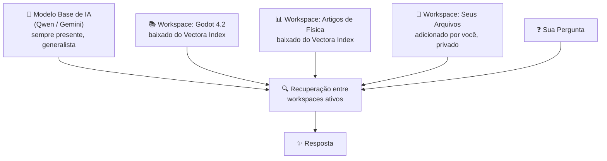

# Vectora

> [!TIP]
> Read this file in another language | Leia esse arquivo em outro idioma.  
> [English](README.md) | [Portugues](README.pt.md)

**Um NotebookLM privado que roda inteiramente na sua máquina.**

O Vectora é um assistente de IA local que aprende com o que você fornecer — documentos, código, artigos, imagens — e responde perguntas estritamente baseadas nesse conteúdo. Pense no Google NotebookLM, mas rodando no seu hardware, com seus dados nunca saindo da sua máquina.

Sem dependência de nuvem. Sem custo recorrente. Nenhum dado sai da sua máquina.

---

## O Problema

Sabe quando você pergunta a uma IA sobre algo muito específico — uma versão particular de um framework, um documento interno, um artigo técnico de nicho — e ela inventa algo ou dá uma resposta genérica que erra o ponto completamente?

Isso acontece porque a IA não tem acesso ao _seu_ contexto. O Vectora resolve isso. Forneça seus arquivos, aponte para uma base de conhecimento e ele responderá exatamente a partir disso — nada mais, nada menos.

---

## Como Funciona

O Vectora faz o embedding de seus arquivos e bases de conhecimento baixadas em bancos de dados vetoriais locais isolados. Quando você faz uma pergunta, ele recupera o contexto semanticamente mais relevante de quaisquer workspaces ativos e envia tudo — junto com sua pergunta — para o modelo de linguagem.



Cada workspace é um namespace completamente isolado. Contextos nunca vazam de um para outro. Você controla quais workspaces estão ativos por sessão.

---

## Vectora Index

O Index é um marketplace curado de bases de conhecimento — datasets vetoriais pré-construídos publicados pela comunidade e revisados pela Kaffyn antes de estarem disponíveis para download.

De dentro do app Vectora, você pode navegar pelo catálogo completo com busca e filtros, ler um README resumido para cada dataset descrevendo seu conteúdo, baixar qualquer dataset diretamente para seu Vectora local como um novo workspace e publicar suas próprias bases de conhecimento para outros usarem.

**Exemplos do que você encontrará no Index:**

- Documentação do Godot 4.x (por versão)
- Referências de frameworks de frontend e backend
- Artigos de engenharia, física e ciência da computação
- Recursos de game design, especificações de linguagens e mais

Todo dataset baixado do Index é indexado e armazenado localmente. Após o download, nenhuma requisição de rede é feita no momento da consulta.

---

## O Que Você Pode Fazer Com Ele?

**Estudo & Pesquisa**
Arraste PDFs, artigos ou notas para um workspace. Peça ao Vectora para explicar, resumir, correlacionar ou testar seus conhecimentos. Tudo permanece local e privado.

**Desenvolvimento**
Combine um workspace de documentação de motor com o workspace do seu próprio código. Obtenha respostas que conhecem tanto o contrato da API quanto sua implementação real.

**Trabalho Profundo**
Use o modo Gemini para indexar imagens, PDFs e áudio junto com texto — tudo processado e armazenado localmente após a indexação.

**Integração com IDE**
Exponha qualquer workspace como um servidor MCP, fornecendo contexto preciso diretamente para ferramentas como Cursor, VS Code ou Claude Code.

---

## Instalação

### Requisitos de Sistema

- **Windows 10+**, **macOS 11+**, ou **Linux** (Ubuntu/Debian)
- **4GB RAM mínimo** (8GB recomendado)
- **500MB espaço em disco** mínimo (mais para modelos maiores)

### Download e Instalação

1. **Baixe o instalador** de [última release](https://github.com/Kaffyn/Vectora/releases)
   - Windows: `vectora-setup.exe`
   - macOS: `vectora-setup.dmg` (em breve)
   - Linux: Instruções de instalação (em breve)

2. **Execute o instalador:**
   - Windows: Clique duplo em `vectora-setup.exe` e siga o assistente
   - O instalador detectará automaticamente seu hardware e recomendará um modelo de IA ideal

3. **Primeira Execução:**
   - Vectora aparecerá na bandeja do sistema
   - Clique para abrir a interface web no seu navegador padrão
   - Ou abra pelo Menu Iniciar → Vectora

### Configuração

**Opção 1: Qwen (Local / Offline)** — Recomendado para privacidade

- Nenhuma configuração necessária para funcionalidade básica
- Vectora baixa automaticamente Qwen3-7B na primeira execução
- Escolha um modelo diferente nas configurações se desejar
- Modelos são armazenados localmente em `%USERPROFILE%\.Vectora\models\`

**Opção 2: Gemini (Nuvem / Multimodal)**

- Vá para Configurações → Provedores de LLM
- Clique em "Configurar Gemini"
- Cole sua chave da API Gemini
- A chave é criptografada e armazenada apenas na sua máquina

### Compilando do Código-Fonte

Se você quer compilar o Vectora você mesmo:

1. **Clone o repositório:**

   ```bash
   git clone https://github.com/Kaffyn/Vectora.git
   cd Vectora
   ```

2. **Instale as dependências:**
   - Veja [CONTRIBUTING.pt.md](CONTRIBUTING.pt.md) para instruções de configuração detalhadas
   - Requer Go 1.22+, Node.js 20+, e Bun

3. **Compile todos os componentes:**

   ```bash
   # Windows (PowerShell)
   .\build.ps1

   # macOS/Linux (Make)
   make build-all
   ```

4. **Execute a aplicação:**
   ```bash
   ./build/vectora
   ```

### Resolução de Problemas de Instalação

**"Windows protegeu seu PC"** ao executar o instalador

- Clique em "Mais informações" → "Executar mesmo assim"
- Isso é normal para instaladores não assinados; seus arquivos são seguros

**O instalador fecha imediatamente**

- Tente executar como Administrador: Clique direito → "Executar como administrador"
- Verifique se seu antivírus não está bloqueando o instalador

**Não consegue encontrar Vectora após a instalação**

- Verifique sua bandeja do sistema (canto inferior direito no Windows, canto superior direito no macOS)
- Ou procure por "Vectora" no Menu Iniciar

**Modelos não baixam ou chat não funciona**

- Certifique-se de ter conexão com internet (necessária para configuração inicial)
- Verifique Configurações → Avançado para logs
- Veja [CONTRIBUTING.pt.md](CONTRIBUTING.pt.md) para resolução de problemas detalhada

### Obtendo Ajuda

- **Documentação:** Veja [CONTRIBUTING.pt.md](CONTRIBUTING.pt.md) para guias de desenvolvedores
- **Problemas:** [Reporte bugs no GitHub](https://github.com/Kaffyn/Vectora/issues)
- **Dúvidas:** Inicie uma [Discussão](https://github.com/Kaffyn/Vectora/discussions)

---

## Provedores de IA

O Vectora suporta dois provedores nativamente, com o motor construído para acomodar mais no futuro:

**Qwen3 (Local / Offline)**
Roda inteiramente no seu hardware via `llama-cli` usando a arquitetura Zero-Port de pipes. Sem necessidade de internet. Suporta a linhagem Qwen3 — desde modelos generalizados leves (0.6B, 1.7B, 4B, 8B) até variantes especializadas de raciocínio e código (veja seção abaixo para detalhes). Ideal para fluxos de trabalho totalmente privados.

**Gemini (Nuvem / Multimodal)**
Usa sua própria chave de API Gemini, armazenada apenas na sua config local. Desbloqueia indexação multimodal — PDFs, imagens e áudio são todos suportados. A chave nunca sai da sua máquina.

Ambos os provedores incluem modelos de embedding dedicados. O Vectora não depende de um serviço de embedding separado.

## Modelos Oficiais Qwen3 e Qwen3.5

O Vectora suporta as novas linhagens **Qwen3** e **Qwen3.5**, otimizadas para diferentes frentes de desenvolvimento:

**Propósito Geral & Instruct**

- **Qwen3 (0.6B/1.7B/4B/8B):** Modelos leves de seguimento de instruções para tarefas gerais, resumização e geração de conteúdo. Footprint pequeno, ideal para ambientes com recursos limitados.

**Código & Raciocínio**

- **Qwen3-Coder-Next (80B):** O estado da arte para refatoração massiva e arquitetura de sistemas.
- **Qwen3-4B-Thinking (2507):** Modelo de raciocínio lógico (Chain-of-Thought) para resolução de bugs complexos.

**Visão & Multimodal (Thinking VL)**

- **Qwen3-VL-Thinking (2B/8B):** Modelos de visão que "pensam" sobre a imagem, ideais para analisar screenshots de bugs de interface ou diagramas de arquitetura.
- **Qwen3-VL-Embedding (2B):** Vetorização de ativos visuais e diagramas para busca semântica em GDDs.

**Áudio & Voz (ASR/TTS)**

- **Qwen3-ASR (0.6B):** Transcrição ultrarrápida de reuniões de sprint e áudios de feedback.
- **Qwen3-TTS-VoiceDesign (1.7B):** Síntese de voz de alta fidelidade (12Hz) para prototipagem de diálogos em tempo real.

**RAG & Embeddings**

- **Qwen3-Embedding (0.6B/4B/8B):** Os motores de busca vetorial que alimentam o chromem-go. **Recomendamos a versão 0.6B** para o limite rigoroso de 4GB de RAM, garantindo que o contexto do seu código seja recuperado com precisão sem comprometer a performance do sistema.

---

## Interfaces

O Vectora não é um único app — é um ecossistema de interfaces compartilhando um core comum via IPC, tudo orquestrado por um daemon leve no systray:

| Interface              | Descrição                                                                                                       |
| ---------------------- | --------------------------------------------------------------------------------------------------------------- |
| **Systray**            | O daemon central. Vive perto do relógio, orquestra tudo, consome ~100MB de RAM.                                 |
| **App Desktop (Fyne)** | Aplicação desktop nativa multiplataforma. Interface de chat, gestão de workspaces, config e navegação no Index. |
| **CLI (Bubbletea)**    | Interface de terminal. Footprint mínimo, resposta instantânea.                                                  |
| **Servidor MCP**       | Expõe o conhecimento do Vectora para ferramentas de IA externas e IDEs.                                         |
| **Agente ACP**         | Modo agente autônomo com acesso ao sistema de arquivos e terminal.                                              |

---

## Toolkit Agêntico

Ao operar em modo MCP ou ACP, o Vectora expõe um conjunto compartilhado de ferramentas construídas do zero em Go:

- **Filesystem:** `read_file`, `write_file`, `read_folder`, `edit`
- **Search:** `find_files`, `grep_search`, `google_search`, `web_fetch`
- **System:** `run_shell_command`
- **Memory:** `save_memory`, `enter_plan_mode`

> [!IMPORTANT]
> Toda ação de escrita ou shell dispara um snapshot automático via `GitBridge` em `internal/git` antes da execução. Qualquer ação agêntica pode ser totalmente revertida com um único comando `undo`.

---

## Arquitetura

O Vectora é escrito inteiramente em Go. O core roda como um daemon leve no systray orquestrado por **Cobra**, o framework CLI padrão da indústria para Go.

| Componente       | Tecnologia          | Papel                                                           |
| ---------------- | ------------------- | --------------------------------------------------------------- |
| Vector DB        | chromem-go          | Busca semântica e embeddings                                    |
| Key-Value DB     | bbolt               | Histórico de chat, logs, configuração                           |
| Motor de IA      | langchaingo         | Abstração de LLM e provedor de embedding (Gemini, extensível)   |
| Inferência Local | llama-cli (pipes)   | Execução de modelos offline (Qwen3)                             |
| **Daemon Core**  | **Cobra + Systray** | **Daemon master: expõe CLI, Systray, IPC (local), API HTTP (remoto)** |
| Instalador       | **Cobra + Fyne**    | **Modo dual: instalação CLI headless ou assistente gráfico**    |
| App Desktop      | **Fyne**            | **Aplicação GUI nativa (subprocesso spawned, via IPC)**         |
| Interface TUI    | **Bubbletea**       | **Interface de Terminal do Usuário (subprocesso spawned, via IPC)** |
| Servidor Index   | Go (net/http)       | Catálogo e distribuição de datasets vetoriais                   |

### Por Que Cobra?

**Cobra** serve como a base CLI unificada tanto para o Instalador quanto para o Daemon:

- **Fonte Única da Verdade**: A mesma lógica de negócio que executa `vectora install --headless` via terminal também alimenta o instalador gráfico. Sem divergência entre modos CLI e GUI.
- **Sem Sidecars**: O Daemon em si _é_ o CLI. Comandos como `vectora status`, `vectora update`, `vectora logs` executam diretamente sem scripts externos ou wrappers.
- **UX Automática**: Quando você executa `vectora` sem flags, Cobra detecta o ambiente e spawna silenciosamente a UI Fyne. Em ambientes headless, opera em modo CLI puro.
- **Headless First**: Essencial para CI/CD, implantações SSH e automação. Um único binário funciona em desktops interativos, servidores headless e pipelines de automação.

### Arquitetura da Interface

```
vectora [Cobra CLI] ← Binário daemon único
├─ --headless → Modo CLI puro (sem UI)
├─ padrão → Systray + UI Fyne (auto-detecção)
├─ tui → Spawna Bubbletea TUI (subprocesso)
└─ http :8080 → API HTTP para MCP/ACP (sempre disponível)
```

**IPC** (pipes/named pipes) gerencia **comunicação inter-processos local** entre daemon e subprocessos de UI.
**HTTP** (necessário para MCP/ACP) gerencia **integrações remotas** com ferramentas externas e IDEs — somos flexíveis aqui, não rigorosos apenas com IPC.

Projetado para operar com **menos de 4GB de RAM** em hardware modesto.

---

## Roadmap

- [ ] Integração completa end-to-end (em progresso)
- [ ] Primeiro release público
- [ ] Lançamento público do Vectora Index
- [ ] Indexação multimodal (imagens, PDFs) via Gemini
- [ ] Transcrição e indexação de áudio
- [ ] Site e documentação do Vectora

---

_Parte da organização open source [Kaffyn](https://github.com/Kaffyn)._
