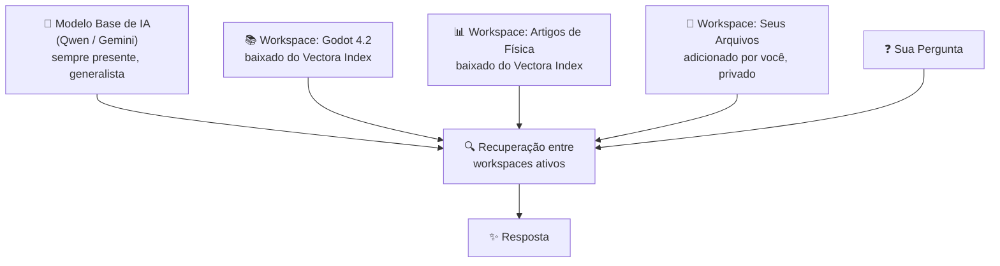

# Vectora

> [!TIP]
> Read this file in another language | Leia esse arquivo em outro idioma.  
> [English](README.md) | [Portugues](README.pt.md)

**Um NotebookLM privado que roda inteiramente na sua máquina.**

O Vectora é um assistente de IA local que aprende com o que você fornecer — documentos, código, artigos, imagens — e responde perguntas estritamente baseadas nesse conteúdo. Pense no Google NotebookLM, mas rodando no seu hardware, com seus dados nunca saindo da sua máquina.

Sem dependência de nuvem. Sem custo recorrente. Nenhum dado sai da sua máquina.

---

## O Problema

Sabe quando você pergunta a uma IA sobre algo muito específico — uma versão particular de um framework, um documento interno, um artigo técnico de nicho — e ela inventa algo ou dá uma resposta genérica que erra o ponto completamente?

Isso acontece porque a IA não tem acesso ao _seu_ contexto. O Vectora resolve isso. Forneça seus arquivos, aponte para uma base de conhecimento e ele responderá exatamente a partir disso — nada mais, nada menos.

---

## 🛡️ Segurança e Privacidade por Design

### Hard-Coded Guardian (Sempre Ativo - Determinístico)

- **Filtro de Sistema:** Independentemente do modo escolhido (Local ou Cloud), o Vectora possui uma camada de proteção interna imutável. As ferramentas de indexação e leitura **ignoram automaticamente** arquivos sensíveis como `.env`, `.key`, `.pem`, bancos de dados (`.db`, `.sqlite`) e binários executáveis (`.exe`, `.dll`, `.so`).
- **Bloqueio na Fonte:** Esses arquivos nunca são lidos, nunca são embutidos no banco vetorial e nunca chegam ao motor de inferência (seja local ou via API).
- **Garantia:** A segurança não depende da inteligência do modelo, mas de regras de sistema operacionais. Seus segredos estão protegidos mesmo se você estiver usando a nuvem.

### Modo Local (Privacidade Total)

- **Modelo Guardião:** O `Qwen3-Embedding` (0.6B) atua como o único processo autorizado para modificar o banco vetorial local e filtrar o conteúdo.
- **Filtragem de Dados (DLP):** Antes de enviar qualquer prompt para a nuvem, o Vectora analisa o contexto recuperado. Se detectar padrões de segredos críticos (chaves, senhas) que passaram pelas camadas anteriores, ele alerta o usuário e bloqueia o envio.

### Modo Cloud-Only (Aviso de Responsabilidade)

- **Contexto Seguro:** Mesmo neste modo, o **Hard-Coded Guardian** impede a indexação de arquivos sensíveis. Apenas documentos legítimos (código-fonte, docs, scripts) são enviados para a API.
- **Transferência de Dados:** Para utilizar as capacidades avançadas da nuvem (Gemini, Claude, etc.), o Vectora envia o contexto recuperado diretamente para o provedor de API.
- **Isenção de Responsabilidade:** Ao ativar o Modo Cloud-Only, o usuário reconhece que está entregando o contexto recuperado para processamento em servidores de terceiros. A Kaffyn **não se responsabiliza** por eventuais vazamentos, uso indevido ou treinamento dos dados pelos provedores de IA externos. Recomendamos fortemente evitar o envio de informações sensíveis, chaves de produção ou código proprietário crítico neste modo.

---

## 📚 Vectora Index: O Coração do Conhecimento

O **Vectora Index** é o ativo estratégico que separa o Vectora de outras IAs genéricas. É um marketplace curado de bases de conhecimento (datasets vetoriais).

### Como Funciona

O Vectora faz o embedding de seus arquivos e bases de conhecimento baixadas em bancos de dados vetoriais locais isolados. Quando você faz uma pergunta, ele recupera o contexto semanticamente mais relevante de quaisquer workspaces ativos e envia tudo — junto com sua pergunta — para o modelo de linguagem.



Cada workspace é um namespace completamente isolado. Contextos nunca vazam de um para outro. Você controla quais workspaces estão ativos por sessão.

### Funcionalidades Principais

- **Datasets Curados:** Documentação oficial (Godot 4.x, Python, Rust), artigos técnicos, especificações de engines e códigos-fonte de referência.
- **Download Seguro:** Datasets baixados são indexados localmente. Após o download, nenhuma requisição de rede é feita na consulta.
- **Re-Embedding Seguro:** Ao publicar um projeto no Index, o conteúdo é processado pelos servidores dedicados da Kaffyn usando `Qwen3-Embedding` antes de ser indexado. Isso garante qualidade máxima sem expor dados brutos a modelos públicos durante o processo.
- **Compartilhamento Restritivo (RBAC):**
  - **Privado:** Apenas você.
  - **Equipe:** Compartilhe com membros específicos via Kaffyn Account. Defina permissões de leitura/escrita.
  - **Público:** Disponível para todos no catálogo. Ao publicar publicamente, você aceita que outros façam RAG sobre esse dataset, mas o processo de indexação foi feito de forma segura.

> [!IMPORTANT] > **Política de Privacidade do Index:** A Kaffyn realiza curadoria e processamento **apenas em datasets marcados como Públicos**. Workspaces **Privados** e de **Equipe** permanecem exclusivamente no seu dispositivo ou na sua nuvem privada criptografada. **Nem a Kaffyn, nem nossos servidores, têm acesso aos dados contidos em workspaces privados ou de equipe.** Eles são seguros, isolados e inacessíveis para nós.

**Exemplos do que você encontrará no Index:**

- Documentação do Godot 4.x (por versão)
- Referências de frameworks de frontend e backend
- Artigos de engenharia, física e ciência da computação
- Recursos de game design, especificações de linguagens e mais

Todo dataset baixado do Index é indexado e armazenado localmente. Após o download, nenhuma requisição de rede é feita no momento da consulta.

---

## O Que Você Pode Fazer Com Ele?

**Estudo & Pesquisa**
Arraste PDFs, artigos ou notas para um workspace. Peça ao Vectora para explicar, resumir, correlacionar ou testar seus conhecimentos. Tudo permanece local e privado.

**Desenvolvimento**
Combine um workspace de documentação de motor com o workspace do seu próprio código. Obtenha respostas que conhecem tanto o contrato da API quanto sua implementação real.

**Trabalho Profundo**
Use o modo Gemini para indexar imagens, PDFs e áudio junto com texto — tudo processado e armazenado localmente após a indexação.

**Integração com IDE**
Exponha qualquer workspace como um servidor MCP, fornecendo contexto preciso diretamente para ferramentas como Cursor, VS Code ou Claude Code.

---

## Instalação

**Requisitos de Sistema:**

- **OS:** Windows 10+, macOS 11+, Linux (Ubuntu/Debian).
- **RAM:** **8GB Mínimo** (Total do Sistema). **16GB Recomendado**.
- **Internet:** Necessária para configuração inicial e uso de modelos cloud.

**Download e Instalação:**

1. **Baixe o Setup** de [última release](https://github.com/Kaffyn/Vectora/releases)

   - Windows: `vectora-setup.exe`
   - macOS: `vectora-setup.dmg`
   - Linux: `vectora-setup.deb`

2. **Execute e Configure os Pacotes**

   - Ao iniciar o setup, ele integrará as ferramentas LPM e MPM para configurar seu ambiente:
   - **LPM (Llama Package Manager):** Responsável por baixar e configurar o motor de inferência (`llama.cpp`) otimizado para o seu hardware.
   - **MPM (Model Package Manager):** Responsável pelo catálogo e download dos modelos de IA.
   - Durante a instalação, utilize a interface para selecionar e baixar o modelo desejado através do **MPM** (ex: **Qwen3-7B** para performance equilibrada ou **Qwen3-0.6B** para hardware modesto).

3. **Primeira Execução**
   - Após a instalação, o **Vectora Daemon** iniciará automaticamente na bandeja do sistema.
   - Clique no ícone para abrir a interface **Desktop (Fyne)** ou digite `vectora tui` no terminal para usar a interface de texto.

**Configuração:**

**Opção 1: Qwen (Local / Offline)** — Recomendado para privacidade

- Nenhuma configuração necessária para funcionalidade básica
- Gerencie seus modelos via **MPM**
- Modelos são armazenados localmente em `%USERPROFILE%\.Vectora\models\`

**Opção 2: Gemini (Nuvem / Multimodal):**

- Vá para Configurações → Provedores de LLM
- Clique em "Configurar Gemini"
- Cole sua chave da API Gemini
- A chave é criptografada e armazenada apenas na sua máquina

---

## Provedores de IA

O Vectora suporta dois provedores nativamente, com o motor construído para acomodar mais no futuro:

**Qwen3 (Local / Offline)**
Roda inteiramente no seu hardware via `llama-cli` usando a arquitetura Zero-Port de pipes. Sem necessidade de internet. Suporta a linhagem Qwen3 — desde modelos generalizados leves (0.6B, 1.7B, 4B, 8B) até variantes especializadas de raciocínio e código (veja seção abaixo para detalhes). Ideal para fluxos de trabalho totalmente privados.

**Gemini (Nuvem / Multimodal)**
Usa sua própria chave de API Gemini, armazenada apenas na sua config local. Desbloqueia indexação multimodal — PDFs, imagens e áudio são todos suportados. A chave nunca sai da sua máquina.

Ambos os provedores incluem modelos de embedding dedicados. O Vectora não depende de um serviço de embedding separado.

## Modelos Oficiais Qwen3 e Qwen3.5

O Vectora suporta as novas linhagens **Qwen3** e **Qwen3.5**, otimizadas para diferentes frentes de desenvolvimento:

- **Qwen3 (1.7B/4B/8B):** Modelos leves de seguimento de instruções para tarefas gerais, resumização e geração de conteúdo. Footprint pequeno, ideal para ambientes com recursos limitados.

- **Qwen3-Embedding (0.6B/4B/8B):** Os motores de busca vetorial que alimentam o chromem-go. **Recomendamos a versão 0.6B** para o limite rigoroso de 4GB de RAM, garantindo que o contexto do seu código seja recuperado com precisão sem comprometer a performance do sistema.

---

## Interfaces

O Vectora não é um único app — é um ecossistema de interfaces compartilhando um core comum via IPC, tudo orquestrado por um daemon leve no systray:

| Interface               | Descrição                                                                                                       |
| ----------------------- | --------------------------------------------------------------------------------------------------------------- |
| **Daemon Core (Cobra)** | O cérebro central. Gerencia ciclo de vida, instalação, atualizações e conexões.                                 |
| **App Desktop (Fyne)**  | Aplicação desktop nativa multiplataforma. Interface de chat, gestão de workspaces, config e navegação no Index. |
| **Vectora TUI**         | Interface de terminal interativa (antigo CLI). Footprint mínimo, resposta instantânea.                          |
| **Servidor MCP/ACP**    | Expõe o conhecimento do Vectora para ferramentas de IA externas e IDEs via HTTP.                                |

---

## Toolkit Agêntico

Ao operar em modo MCP ou ACP, o Vectora expõe um conjunto compartilhado de ferramentas construídas do zero em Go:

- **Filesystem:** `read_file`, `write_file`, `read_folder`, `edit`
- **Search:** `find_files`, `grep_search`, `google_search`, `web_fetch`
- **System:** `run_shell_command`
- **Memory:** `save_memory`, `enter_plan_mode`

> [!IMPORTANT]
> Toda ação de escrita ou shell dispara um snapshot automático via `GitBridge` em `internal/git` antes da execução. Qualquer ação agêntica pode ser totalmente revertida com um único comando `undo`.

---

## Arquitetura

O Vectora é escrito inteiramente em Go. O core roda como um daemon leve no systray orquestrado por **Cobra**, o framework CLI padrão da indústria para Go.

| Componente       | Tecnologia          | Papel                                                                                          |
| ---------------- | ------------------- | ---------------------------------------------------------------------------------------------- |
| Vector DB        | chromem-go          | Busca semântica e embeddings                                                                   |
| Key-Value DB     | bbolt               | Histórico de chat, logs, configuração                                                          |
| Motor de IA      | **Direct Calls**    | Chamadas HTTP/STDIO otimizadas para APIs e `llama.cpp`. Sem overhead de frameworks.            |
| Inferência Local | llama-cli (pipes)   | Execução de modelos offline (Qwen3)                                                            |
| **Daemon Core**  | **Cobra + Systray** | **Daemon master: expõe CLI, Systray, IPC (local), API HTTP (remoto)**                          |
| Instalador       | **Cobra + Fyne**    | **Modo dual: instalação CLI headless ou assistente gráfico**                                   |
| App Desktop      | **Fyne**            | **Aplicação GUI nativa (subprocesso spawned, via IPC)**                                        |
| Interface TUI    | **Bubbletea**       | **Interface de Terminal do Usuário (subprocesso spawned, via IPC)**                            |
| Servidor Index   | Go (net/http)       | Catálogo e distribuição de datasets vetoriais                                                  |
| LPM/MPM          | **Cobra CLI**       | Ferramentas de linha de comando puras para gerenciamento de binários Llama.cpp e Modelos GGUF. |

### Por Que Cobra?

**Cobra** serve como a base CLI unificada tanto para o Instalador quanto para o Daemon:

- **Fonte Única da Verdade**: A mesma lógica de negócio que executa `vectora install --headless` via terminal também alimenta o instalador gráfico. Sem divergência entre modos CLI e GUI.
- **Sem Sidecars**: O Daemon em si _é_ o CLI. Comandos como `vectora status`, `vectora update`, `vectora logs` executam diretamente sem scripts externos ou wrappers.
- **UX Automática**: Quando você executa `vectora` sem flags, Cobra detecta o ambiente e spawna silenciosamente a UI Fyne. Em ambientes headless, opera em modo CLI puro.
- **Headless First**: Essencial para CI/CD, implantações SSH e automação. Um único binário funciona em desktops interativos, servidores headless e pipelines de automação.

### Arquitetura da Interface

```
vectora [Cobra CLI] ← Binário daemon único
├─ --headless → Modo CLI puro (sem UI)
├─ padrão → Systray + UI Fyne (auto-detecção)
├─ tui → Spawna Bubbletea TUI (subprocesso)
└─ http :8080 → API HTTP para MCP/ACP (sempre disponível)
```

**IPC** (pipes/named pipes) gerencia **comunicação inter-processos local** entre daemon e subprocessos de UI.
**HTTP** (necessário para MCP/ACP) gerencia **integrações remotas** com ferramentas externas e IDEs — somos flexíveis aqui, não rigorosos apenas com IPC.

Projetado para operar com **menos de 4GB de RAM** em hardware modesto.

---

_Parte da organização open source [Kaffyn](https://github.com/Kaffyn)._
