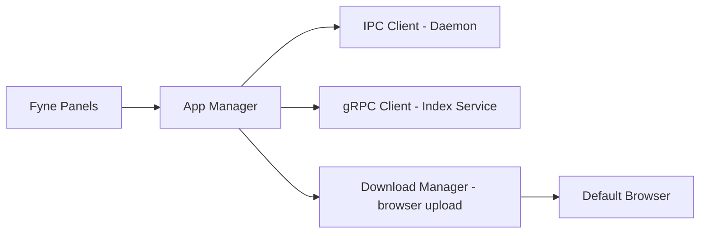

# Desktop App (Fyne): Plano de Implementação (Fase 2)

Este documento detalha a transição da interface desktop atual (Phase 1/Mocks) para um cliente de produção integrado ao **Index Service** e ao **Daemon Local**.

## Arquitetura de Integração

## User Review Required

> [!IMPORTANT]
> **Segurança de Credentials**: Como os usuários se autenticam para acessar seus Workspaces remotos? No momento, o `owner_id` é passado como string simples. Precisamos de um token de autenticação (Kaffyn Account) no futuro?
> **Estética**: Manter o tema "Modern Dark" com fontes `Outfit` ou `Inter` conforme os padrões premium.

## Proposed Changes

### 1. Cliente gRPC Real (Index Integration)
Remover os placeholders e conectar ao backend.

#### [MODIFY] [desktop/index_client.go](file:///c:/Users/bruno/Desktop/Vectora/desktop/index_client.go)
*   Integrar os stubs gerados via `protoc`.
*   Implementar `CreateWorkspace`, `CreateIndex`, `ListIndexes` e `SearchDocuments` usando chamadas gRPC reais.
*   Adicionar tratamento de erros robusto com diálogos UI (`dialog.ShowError`).
*   **Timeout**: Configurar timeouts apropriados para operações remotas (ex: 15s).

---

### 2. Monitoramento de Uploads (Resiliência)
Concluir o `DownloadManager` para rastrear o progresso do navegador.

#### [MODIFY] [desktop/download_manager.go](file:///c:/Users/bruno/Desktop/Vectora/desktop/download_manager.go)
*   Implementar o loop de monitoramento (`monitorSessions`) que consulta o servidor a cada 5 segundos para sessões `pending` ou `uploading`.
*   Emitir notificações na UI quando um upload é concluído ou falha.
*   **Retry**: Adicionar lógica para reabrir a URL de upload se o usuário clicar no botão "Retomar".

---

### 3. Melhorias nos Painéis da UI
Tornar a interface dinâmica e responsiva.

#### [MODIFY] [desktop/ui/index.go](file:///c:/Users/bruno/Desktop/Vectora/desktop/ui/index.go)
*   **Listagem**: Carregar índices reais do servidor ao abrir a aba ou clicar em "Refresh".
*   **Dialogs**: Implementar o formulário real para criação de Novo Índice (Nome, Descrição, Workspace).
*   **Status**: Mostrar barra de progresso individual para uploads em andamento.

#### [MODIFY] [desktop/ui/chat.go](file:///c:/Users/bruno/Desktop/Vectora/desktop/ui/chat.go)
*   Permitir que o usuário selecione um "Contexto de Índice" para a conversa (ex: buscar em um índice remoto antes de responder).

---

### 4. Persistência de Dados Locais
Garantir que o estado seja mantido entre reinicializações.

#### [NEW] [desktop/history.go](file:///c:/Users/bruno/Desktop/Vectora/desktop/history.go)
*   Salvar histórico de conversas localmente no BBolt (via Daemon).

## Open Questions

> [!WARNING]
> **Offline Mode**: Como a UI deve se comportar quando o **Index Service** estiver inacessível (ex: esconder a aba Index ou mostrar aviso de offline)?
> **Atualização Automática**: O Desktop App deve verificar se há atualizações do binário?

## Verification Plan

### Manual Verification
1.  **Conexão**: Alterar `index_service_addr` nas configurações para um servidor real e verificar o círculo verde "● Index Service" na barra de status.
2.  **Upload**: Clicar em "Publicar", confirmar abertura do navegador, realizar upload e ver o status mudar no app de "Pending" para "Complete".
3.  **Busca**: Realizar uma pergunta no Chat que dependa do conteúdo indexado e validar se a resposta cita os documentos corretos.
4.  **Resiliência**: Fechar o app durante um upload no navegador e reabrir para verificar se o monitoramento continua corretamente.
