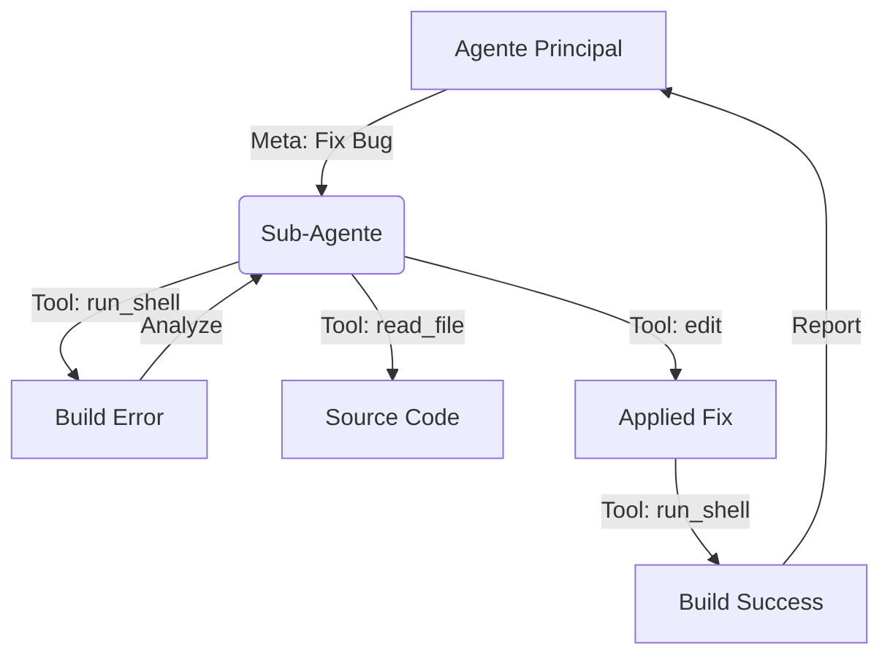

# Blueprint: Ferramentas Agênticas & Sub-Agentes (ACP/MCP)

**Status:** Implementado  
**Módulo:** `core/tools/` & `core/engine/`  
**Protocolo:** JSON-RPC 2.0 (Stdio)

Este blueprint descreve a arquitetura de execução de ferramentas e a dinâmica de delegação para sub-agentes especializados no ecossistema Vectora.

---

## 1. O Conceito de Sub-Agente (Recursividade de Raciocínio)

No Vectora, o **Sub-Agente** não é apenas uma ferramenta, mas uma instância de raciocínio delegada e autônoma. Enquanto o Agente Principal gerencia a interface com o usuário e o fluxo global da conversa, o Sub-Agente é disparado para resolver problemas técnicos complexos que exigem múltiplos passos de ação e verificação.

### Arquitetura de Delegação:

1.  **Orquestração (Agente Principal):** Identifica que uma tarefa (ex: "Refatore este módulo para usar interfaces") exige mudanças profundas em múltiplos arquivos.
2.  **Disparo do Sub-Agente:** O agente principal invoca a ferramenta interna `spawn_sub_agent`.
3.  **Loop do Sub-Agente (Thought -> Act -> Observe):**
    - O Sub-Agente recebe o objetivo e um Context Window limpo (ou focado).
    - Ele tem permissão total para usar as ferramentas (FS, Terminal, Search).
    - Ele executa planos, testa o código (via terminal) e corrige erros iterativamente.
4.  **Consolidação:** O Sub-Agente retorna o resultado final (ou falha) para o Agente Principal, que então responde ao usuário.

### Vantagens:

- **Isolamento de Erros:** Se um sub-agente falha em um refactor, o histórico do chat principal não fica poluído com logs de erro de compilação.
- **Especialização:** Diferentes sub-agentes podem ser configurados com system prompts específicos (ex: um sub-agente especializado em Segurança vs um especializado em Performance).

---

## 2. Interface Unificada de Ferramentas (`tool.go`)

Todas as ferramentas seguem o contrato `Tool`, permitindo registro dinâmico e exportação via MCP para clientes externos.

```go
package tools

import (
	"context"
	"encoding/json"
)

type ToolResult struct {
	Output   string                 `json:"output"`
	IsError  bool                   `json:"is_error"`
	Metadata map[string]interface{} `json:"metadata,omitempty"`
}

type Tool interface {
	Name() string
	Description() string
	Schema() string
	Execute(ctx context.Context, args json.RawMessage) (*ToolResult, error)
}
```

---

## 3. Toolkit Implementado (Tier 1 & 2)

O Vectora expõe um conjunto de ferramentas nativas otimizadas para o Core Go:

### A. Ferramentas de Sistema de Arquivos

- **`read_file`**: Leitura segura com truncagem inteligente (MAX 50KB) para evitar estouro de contexto.
- **`write_file`**: Escrita atômica. O sistema dispara automaticamente um `git snapshot` antes de cada alteração.
- **`edit` (Search & Replace)**: Realiza substituições granulares baseadas em padrões, evitando reescritas desnecessárias de arquivos gigantes.
- **`read_folder`**: Lista arquivos e diretórios, ignorando automaticamente o que está no `.gitignore` ou no motor de exclusão do `Guardian`.

### B. Ferramentas de Pesquisa e Navegação

- **`grep_search`**: Busca por Regex ultrarrápida (ripgrep-style) usada pelo sub-agente para localizar definições.
- **`find_files`**: Localização de arquivos por glob patterns.
- **`google_search`**: (Em breve/Sub-Agent Only) Pesquisa web externa para documentação de APIs desconhecidas.

### C. Segurança (Guardian Enforcement)

Nenhuma ferramenta pode sair do diretório definido como **Trust Folder**. O motor de políticas `Guardian` intercepta todas as chamadas para bloquear acesso a arquivos sensíveis (`.env`, `id_rsa`, etc).

---

## 4. Dinâmica de Execução (Chain-of-Tools)

O Sub-Agente utiliza a técnica de **Chain-of-Tools**, onde o resultado de uma ferramenta (ex: erro de compilação no `terminal_run`) serve como entrada para a próxima ação (ex: `read_file` no arquivo problemático).



---

## 5. Próximos Passos (Evolução)

1.  **Sub-agentes Multi-Modelos**: Disparar um sub-agente usando Claude 3.5 Opus para arquitetura e Gemini 1.5 Flash para execução de testes.
2.  **Protocolo Unificado**: Garantir que as tools do Core sejam consumíveis nativamente por qualquer cliente via MCP (Model Context Protocol).
