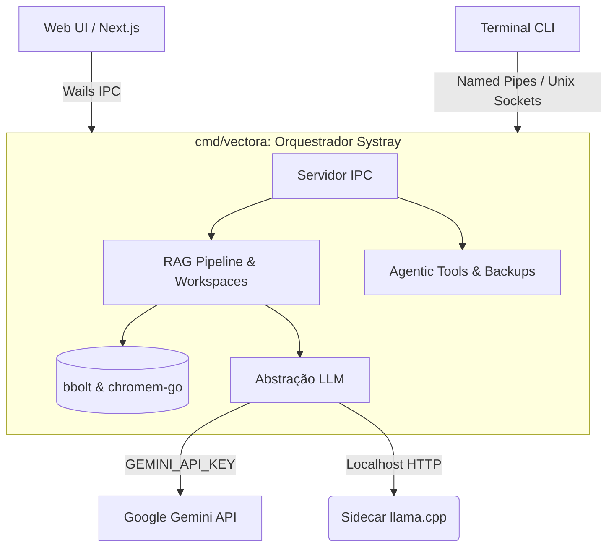

# Vectora: Blueprint Completo e Plano de Implementação de Engenharia

Este documento atua como o **Single Source of Truth (SSOT)** absoluto para a construção do assistente Vectora. Detalharemos _cada módulo, cada backend, cada interface, contrato de dados e sequenciamento de codificação_. Nenhuma implementação pode divergir das especificações descritas aqui sem reavaliação arquitetural rigorosa.

---

## 1. Topologia do Sistema e Arquitetura Global

O ecossistema Vectora é segmentado nos seguintes binários finais:

1. **`cmd/vectora` (Daemon):** Processo residente em Go `(~50-100MB RAM)`. Possui todo o estado do sistema, a API do backend, os serviços de RAG e do motor LLM.
2. **`cmd/vectora-web` (Web UI):** Frontend rodando Wails Go + Next.js (SSG). Interface Rica primária.
3. **`cmd/vectora-cli` (CLI):** Aplicação de terminal baseada em Bubbletea (TUI rápida).
4. **`cmd/vectora-installer` (Setup):** Instalador Fyne (CGO) contendo extraidor de Llama.cpp embutido e downloader HTTP para GGUF do Qwen3.
5. **Sidecar Llama.cpp (Processo Filho):** Instanciado pelo Daemon na porta dinâmica de localhost para inferências offline GGUF.



---

## 2. Padrões de Diretórios e Configurações S.O.

- **`.env` (Environment):** `%USERPROFILE%/.Vectora/.env` guarda a `GEMINI_API_KEY`, flags de permissão de tools e settings globais de usuário.
- **Armazenamento de Dados:** `%USERPROFILE%/.Vectora/data/` conterá:
  - `vectora.db` (bbolt)
  - `chroma/` (Coleções Chromem-go isoladas por Workspace)
- **Log Dir:** `%USERPROFILE%/.Vectora/logs/` contendo `daemon.log`, `wails.log`. Rotação a cada 10MB, guardando os últimos 5 arquivos.
- **Backup Dir:** `%USERPROFILE%/.Vectora/backups/`. Guarda o shadow copy dos arquivos alterados por tools.

---

## 3. Especificação do Backend Go (`internal/`)

### 3.1 Infra & Logging (`internal/infra`)

**Responsabilidades:** Carregar Configs locais via godotenv e prover logging estruturado JSON para ser amigável à inspeções e parsers.

- **Pacote:** `internal/infra`
- **Componentes:**
  - `ConfigLoader`: Busca chaves do arquivo estático (API_KEY, TRAY_RAM_LIMIT, LLAMA_PORT_OVERRIDE).
  - `Logger (`slog`)`: Escreve com formato JSON (`slog.JSONHandler`). Em release mode, suprime Debug logs para limitar disco. Anexa caller info (linha+arquivo) se houver PANIC recovery.

### 3.2 IPC: Inter-Process Communication (`internal/ipc`)

**Responsabilidades:** Ponte de eventos e comandos entre a interface visual e o cérebro central. Permite streaming de logs da tool e barra de progresso do RAG Indexer.

- **Protocolo Base:** Sockets JSON-ND (Newline-Delimited JSON) usando Named Pipes no Windows (`\\.\pipe\vectora`) e UDS no unix.
- **Schema Base:**

```go
  type IPCMessage struct {
      ID      string          `json:"id"`
      Type    string          `json:"type"`   // "request", "response", "event"
      Method  string          `json:"method"` // ex: "workspace.query"
      Payload json.RawMessage `json:"payload"`
      Error   *IPCError       `json:"error,omitempty"`
  }
```

_Tabela Opcional de Eventos Essenciais:_

1. **`shell_stream_chunk`:** Evento disparado pelo IPC contendo `Payload: { "text": "...bytes do terminal..." }` emitido a cada 50ms quando a shell tool é executada.
2. **`rag_index_progress`:** Payload: `{ "workspace_id": "...", "files_done": 12, "files_total": 45 }`.

### 3.3 Banco de Dados & RAG (`internal/db` e `internal/core`)

**Responsabilidades:** Evitar vazamento de vetores entre workspaces (Iron Rule 3) e abstrair a ingestão pesada de RAG respeitando os limites da máquina do usuário (4GB Max Total System RAM).

- **Banco-Chave-Valor (`internal/db/store.go`):**
  - Usará o `bbolt`.
  - Bucket 1: `workspaces` (ID -> Metadados)
  - Bucket 2: `sessions` (Histórico de chats UUID -> array de mensagens)
  - Bucket 3: `settings` (UI Preferências)
- **Banco Vetorial (`internal/db/vector.go`):**
  - Usará o `chromem-go`. Cada Workspace invoca uma `chromem.NewCollection("ws_" + id)`.

- **Estratégia de Chunking (`internal/core/indexer.go`):**
  - Para garantir performance previsível sobre limites de memória curtos nos modelos de Embedding da Qwen/Gemini, todo texto inserido roda em um Sematic Splitter: Max **512 tokens** com **50 tokens de overlap**.
  - O Indexador processa concorrentemente, mantendo num canal de buffer de max 5 workers (limitando o pico de RAM).

### 3.4 Motor de IA e Sidecar LlaMa (`internal/llm`)

**Responsabilidades:** Isolamento rigoroso dos conectores externos de código para RAG.

- **Interface Base:** `Provider.Complete(ctx, msg, tools)` e `Provider.Embed(ctx, text)`.
- **Implementação Qwen3 (`internal/llm/qwen.go`):**
  - **Lifecycle:** Lê de configurações qual binário `llama.cpp` iniciar. Ocasionalmente procura em porta fixa? Não, o daemon aloca `listener := net.Listen("tcp", "127.0.0.1:0")` para pegar uma porta TCP aleatória livre no host, e aciona:
    `exec.Command("llama.cpp", "-m", "qwen.gguf", "--port", "12345", "--embeddings", "--ctx-size", "4096")`
  - Inclui Context Cancellation propagando KILL command para abortar gerações.
- **Implementação Gemini (`internal/llm/gemini.go`):**
  - Usa a API-KEY lida do `.env`. Faz binding com o pacote do provedor respectivo via `langchaingo/providers/google`. Multimodality usa o sistema de parse via upload/file-uri base64 se a imagem puder caber na memória, preferencialmente suportando a Vision capability oficial do Google.

### 3.5 Toolkit e Undo via File Tracker (`internal/tools`)

**Responsabilidades:** Em ponderação de IA que escreve código, o FileTracker é o "Cinto de Segurança". Não usa Git.

- **Tools Definidas:** filesystem (`edit`, `write_file`, `read`), Web (`search`), Sistema (`shell`).
- **Implementação do FileTracker (`internal/tools/tracker.go`):**
  1. A Interface recebe invocação de Tool do LLM via completion parsing (_tool_call_).
  2. O Engine captura `write_file(path, content)`.
  3. Antes de abrir o arquivo local de `path`, copia ele em stream para `%USERPROFILE%/.Vectora/backups/<uuid>-<filename>.bak`.
  4. Escreve a alteração do LLM no `path`.
  5. Se o UI mandar Desfazer (Undo call no front), ele abre o backup listado mais recente atrelado ao uuid e sobrescreve o arquivo no diretório target original.
- **Implementação Shell (`internal/tools/shell.go`):**
  - Cria subprocessos. Em vez de buffering em RAM, atrela um relé entre `Stdout` e a IPC Connection (veja Evento `shell_stream_chunk`).

---

## 4. Frontend Web e Wails Bridge (`web/` e `cmd/vectora-web`)

### 4.1 Estrutura Next.js App Router (React 18/19)

**Responsabilidades:** A UI deve espantar de premium, carregamento estático e responsiva sem chamadas lentas JS (Zero state bloqueante).

- **Setup:** Criado no modo `out` (Static HTML Export) via `.next`.
- **Bibliotecas Core:**
  - Estilização: **Tailwind CSS**.
  - Componentes: **shadcn/ui** (Dialog, Scroll-Area, Avatars, Buttons, Select, Tooltips).
  - Estado Compartilhado Flexível: **Zustand** (Mantém referências ativas ao chat history temporário se as props Wails demorarem 10ms).
  - Animações: **Framer Motion** (Subtle micro-interactions como Skeleton Loadings de Mensagem e painéis deslizantes).

### 4.2 Views & Rotas Físicas (SPA-like)

Como a UI é desktop-first local via WebView2/WebKit, o AppRouter Next agirá focado na componentização.

- `/` -> **ChatWindow:** Histórico, bolhas LLM/User misturado com blocos renderizados (se a resposta tiver difftools (ex: alteração de código), usa componente custom `CodeDiffVisualizer`).
- `/workspaces` -> Painel complexo. Grid de caixas (shadcn/cards) com indicadores radiais de andamento do Indexing.
- `/settings` -> Inputs encriptados pra Gemini Keys, Slider de memória RAM alocada para o local GGUF. Selecionar o Provider Ativo.

### 4.3 Binding Wails (Ponte Frontend-Daemon)

- O Wails exporta no TS a classe de classe mágica:
  `window.go.main.App.ExecuteCommand(method string, payload string)`
- No Front end, o hook de chat do Zustand se subscreve globalmente em `wails.Events.On("shell_stream_chunk", ...)` adicionando o pedaço no final da última bolha de mensagem ativa do TerminalView.

---

## 5. UI Terminal CLI (`cmd/vectora-cli`)

- **Design Pattern:** A biblioteca TUI oficial adotada é a **Bubbletea**.
- **Modelos Bubbletea (`Update`, `View`):**
  - Uma View de chat baseada no componente `viewport`.
  - Controle das Inputs via `textinput` do Bubbletea.
- O CLI interage com o IPC cliente diretamente via sockets para enviar Query, recebendo progressões na TUI como Spinners animados (`spinner` component do bubbles). A CLI tem estado Zero; saindo da CLI e abrindo WebUI, o mesmo chat persiste devido à camada `internal/db/sessions`.

---

## 6. O Instalador Inteligente (`cmd/vectora-installer`)

**Responsabilidades:** Distribuir o app pesado em computadores de usuários e configurar o GGUF local. Fyne renderiza de um binding CGO usando OpenGL cruzado nativo.

- **View Principal (Fyne):** Janela "Welcome to Vectora" -> Set path `%USERPROFILE%/.Vectora` -> "Select Engine (Gemini API vs Local Qwen3)" -> Se Local Qwen3 selecionado, revela Widget ProgressBar (`widget.NewProgressBar()`).
- **Downloader:** Realiza `http.Get` em arquivo GGUF pesando ~2.5GB (Qwen3 4B), efetuando chunks limitados para não crashar por uso de RAM de download, descarregando streams ao disco com feedback responsivo na progress bar.
- Finaliza injetando as rotinas no Menu Iniciar/LaunchPad.

---

## 7. A Orquestração de Deploy e Bootstrapping (O Makefile)

Os comandos necessários para a rotina do desenvolvedor local e os passos iniciais de andamento do repositório ditarão nossa abordagem na base do código:

- `make setup`: Cria os .env, limpa o %USERPROFILE% simulando um primeiro uso total.
- `make generate-ui`: Dispara `npm build && npm export` do Next e embutirá o site.
- `make dev-web`: Levanta localmente via `wails dev` usando o IPC e recarga rápida do React.
- `make build-all`: CGO disabled para core e cross-compilation target.

---

## 8. Cronograma Prático e Etapas da Programação

Para iniciar a codificação, esta é exatamente a sequência de ações isoladas que o Assistente (AI) abordará de agora em diante com o Operador Humano em seus turnos, garantindo 100% de coerência e TDD quando aplicável:

### Etapa 1: Espinha Dorsal (Go Core)

Criar os diretórios base, o `config.go`, `logger.go`, as regras do File Tracker no diretório, definindo as abstrações e testes isolados do IPC Sockets. E lançar o boilerplate principal do Daemon (`cmd/vectora/main.go + tray.go`).

### Etapa 2: A IA e o Backend do RAG

Implementar a abstração Langchain (`internal/llm/provider.go`) e os dois clientes gêmeos (`qwen.go` via subprocess management localhost http listener e `gemini.go`). Fazer o binding do Chromem-go e testar ingestão de chunks com bbolt.

### Etapa 3: Wails + Next.js Base (A Interface Visual Rica)

Bootstrappar a pasta `web/` usando `npx create-next-app@latest`, e invocar a instalação do Tailwind e CLI do Shadcn/ui. Ligar o Wails binding simples de Echo, garantindo conectividade Front e Back antes de complicar estado com zustand.

### Etapa 4: Ferramentas do Agente

Amarrar o fluxo de RAG ao LLM, ligando as system functions em formato compatível pra API de AgentTooling. Subir FileTracker validando que Backups são re-escritos nas pastas de restauro de ponta a ponta.

### Etapa 5: O Integrador Final e Refino

Implementar componentes Shadcn da UI, desenhando o Chat com Framer Motion (para fluidez visual de bolhas e skeletons). Empacotar tudo na `Makefile` e conceber a aplicação no Fyne (Instalador).

---

### Verificação do Contrato de Desenvolvimento (O Checklist):

- O código submetido usa Go 1.22+ e é imutável em suas promessas de limite da RAM estabelecida `(4GB sistema, ~100MB daemon)`?
- Interfaces Next.js chamam provedores da nuvem diretamente pelo site? **Não.** Tudo flui pelo Wails Bridge e pelo `internal/ipc`.
- A interface exibe animação em shell tracking em streaming baseados na `std-out`? **Sim, imperativo que a IPC despache stream json.**

**(Fim do Documento SSOT Oficial / Vetor Final de Design e Arquitetura Engenheirada do Sistema Vectora).**
