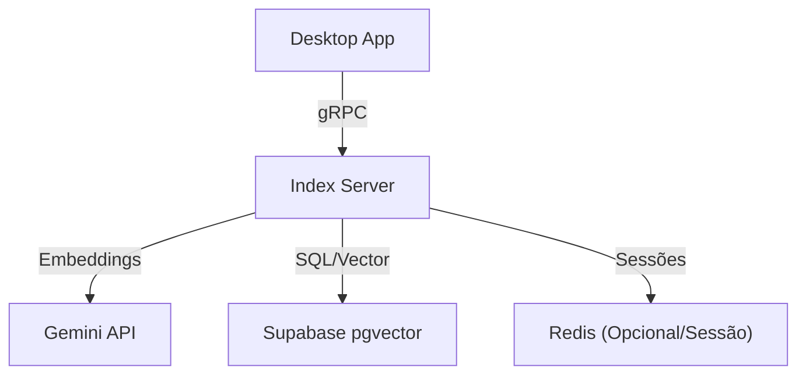

# Index Service: Plano de Implementação Detalhado

Este documento detalha o backend de indexação vetorial, convertendo o esqueleto atual em um motor de RAG (Retrieval-Augmented Generation) escalável e performático.

## Arquitetura de Serviço

## User Review Required

> [!IMPORTANT]
> **Modelo de Embedding**: Confirmar o uso de `text-embedding-004` (Gemini) como padrão para 1536 dimensões.
> **Database Host**: Supabase (PostgreSQL 14+ com pgvector habilitado).

## Proposed Changes

### 1. Protobuf e gRPC (Ponte de Comunicação)
Gerar stubs robustos e implementar o servidor real.

#### [MODIFY] [internal/grpc/server.go](file:///c:/Users/bruno/Desktop/Vectora/services/index/internal/grpc/server.go)
*   Registrar `vectora.index.v1.IndexServiceServer`.
*   Implementar interceptores de Logging e Recuperação de pânico.
*   Suportar Graceful Shutdown.

#### [NEW] [internal/grpc/handler.go](file:///c:/Users/bruno/Desktop/Vectora/services/index/internal/grpc/handler.go)
*   **CreateWorkspace/Index**: Validações de entrada e mapeamento para o serviço interno.
*   **UploadDocument**: Suporte a gRPC Stream bi-direcional ou unidirecional para chunks de arquivos grandes (se usado internamente).
*   **SearchDocuments**: Orquestração entre geração de embedding da query e busca vetorial no DB.

---

### 2. Embeddings e Inteligência
Implementar a camada que transforma texto em vetores.

#### [NEW] [internal/embedding/provider.go](file:///c:/Users/bruno/Desktop/Vectora/services/index/internal/embedding/provider.go)
*   Cliente `google.golang.org/api/generativelanguage/v1beta`.
*   Método `GenerateEmbedding(ctx, text) []float32`.
*   Suporte a batch embedding para otimização de custo e tempo.

---

### 3. Persistência Vetorial (Supabase/pgvector)
Lógica de busca e gerenciamento de chunks.

#### [NEW] [internal/service/search.go](file:///c:/Users/bruno/Desktop/Vectora/services/index/internal/service/search.go)
*   Busca via `similarity_score` usando cosseno (`<=>`).
*   Limite de `topK` e `minScore` configuráveis via RPC.
*   Filtros obrigatórios por `workspace_id` e opcional por `index_id` para segurança (isolamento de usuários).

#### [MODIFY] [internal/service/document.go](file:///c:/Users/bruno/Desktop/Vectora/services/index/internal/service/document.go)
*   **Chunking Logic**: Implementar divisão de documentos em janelas deslizantes (ex: 512 tokens com overlap de 50).
*   **Pipeline de Indexação**: Transação atômica que salva o documento, seus chunks e os vetores associados.

---

### 4. Gestão de Sessões de Upload
Suporte ao fluxo resiliente via navegador.

#### [MODIFY] [internal/service/workspace.go](file:///c:/Users/bruno/Desktop/Vectora/services/index/internal/service/workspace.go)
*   Gerar IDs de sessões assinadas (JWT) para as URLs de upload.
*   Manter estado em DB/Memória: `pending`, `processing`, `completed`.

## Open Questions

> [!WARNING]
> **Rate Limiting**: Precisamos implementar limites de requisição por Workspace para evitar abusos na API do Gemini/Supabase?
> **Formatos de Arquivo**: Quais extensões serão suportadas inicialmente? (PDF, TXT, MD, DOCX).

## Verification Plan

### Automated Tests
*   `go test ./internal/service/...` - Testes unitários com mocks de DB.
*   Integration Test: `test/integration/upload_search_test.go` (requer Supabase local/teste).

### Manual Verification
1.  Executar `make run`.
2.  Chamar `Health()` via `grpcurl`.
3.  Simular upload de documento via script e validar busca vetorial retornando resultados relevantes.
